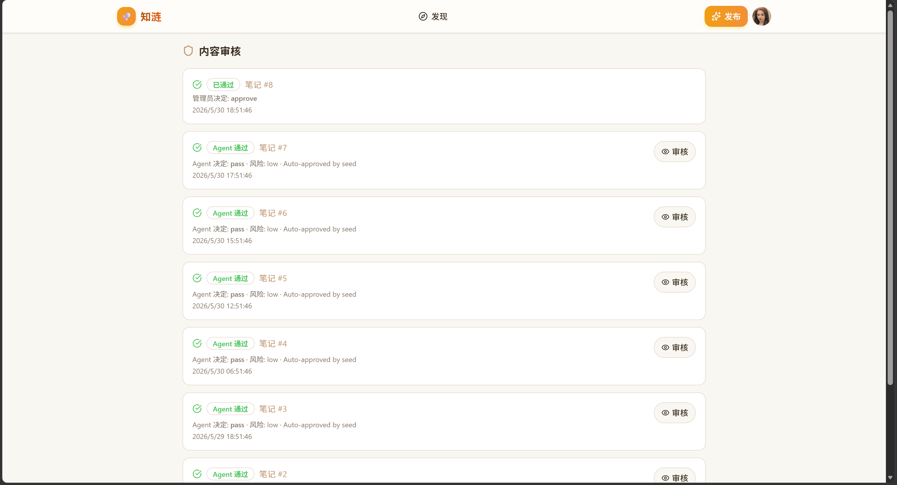

#  知涟 Ripple Note

一个Feed流知识分享社区平台，涵盖内容发布、Feed 流分发、社交互动、审核治理等完整链路。

## 技术栈

| 层级 | 技术 |
|------|------|
| 后端 | Go · Gin · GORM |
| 数据库 | MySQL · Redis |
| 消息队列 | RabbitMQ |
| 前端 | React · TypeScript · Vite · Tailwind CSS |
| 部署 | Docker Compose |

## 功能

- 📝 图文笔记发布（图片上传、标签、拖拽上传）
- 📰 Feed 流（最新 / 热门 / 关注，cursor 分页 + 瀑布流）
- ❤️ 社交互动（点赞、收藏、评论、关注）
- 🔍 内容审核（AI 预审 + 人工复审）
- 🛡️ 管理后台（审核任务列表、手动决策）

## 演示截图

<!-- 请将截图放入 docs/screenshots/ 目录，替换下方文件名即可 -->

| 首页 Feed 流 | 笔记详情 |
|:---:|:---:|
|  |  |

| 发布笔记 | 登录 |
|:---:|:---:|
|  |  |

| 个人中心 | 内容审核 |
|:---:|:---:|
|  |  |

## 快速启动

```bash
# 启动后端
go run ./cmd/server

# 启动前端
cd web && npm install && npm run dev
```

需要 MySQL、Redis、RabbitMQ。配置文件在 `configs/`。

## 项目结构

```
├── cmd/
│   ├── server/      # HTTP API 服务
│   ├── worker/      # 异步事件消费
│   └── seed/        # 数据填充
├── internal/        # 业务逻辑
│   ├── account/     # 用户账号
│   ├── auth/        # 认证鉴权 (JWT)
│   ├── note/        # 笔记 CRUD
│   ├── feed/        # Feed 流聚合
│   ├── interaction/ # 点赞/收藏/评论/关注
│   ├── review/      # 审核流程
│   ├── outbox/      # 领域事件发件箱
│   ├── cache/       # Redis 缓存层
│   ├── storage/     # 图片存储
│   └── ...
├── web/             # React 前端
├── configs/         # 配置文件
└── docs/            # 设计文档
```

## License

MIT
